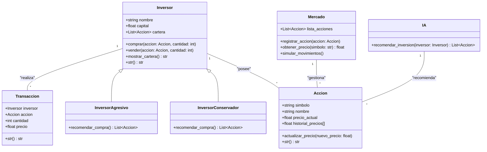

# SIMULADOR DE BOLSA

# DESCRIPCIÓN
Este simulador permitirá a los usuarios:

· Comprar y vender acciones en base a datos reales del mercado.

· Analizar el rendimiento de sus inversiones con gráficos.

· Simular estrategais de inversión a corto y largo plazo.

# Qué necesitas saber antes de probar nuestro código
Para que no haya errores a la hora de probar nuestro código, te recomendamos ejecutar todo el interior de requirements.txt
En este archivo se incluye la instalación de todas las librerías necesarias para la ejecución del *SIMULADOR DE BOLSA DE VALORES*.

# Distribución de tareas
1. *******
2. *******
3. *******
4. *******

# Estructura
-  `Done`
-  `In process`
-  `Not started`

# Colaboradores

<!-- readme: collaborators -start -->
<table>
<tr>
    <td align="center">
        <a href="https://github.com/alg204">
            
             
            <b>Adrián</b>
        </a>
    </td>
    <td align="center">
        <a href="https://https://github.com/ppf30">
            
             
            <b>Patricia</b>
        </a>
    </td>
    <td align="center">
        <a href="https://github.com/NikolasKaplan1">
            
             
            <b>Nikolas</b>
        </a>
    </td>
    <td align="center">
        <a href="https://github.com/Mohamed-Arahouani">
            
             
            <b>Mohamed</b>
        </a>
    </td></tr>
</table>

# Licencia

Este proyecto está bajo la licencia MIT. Ver el archivo LICENSE para más detalles.
