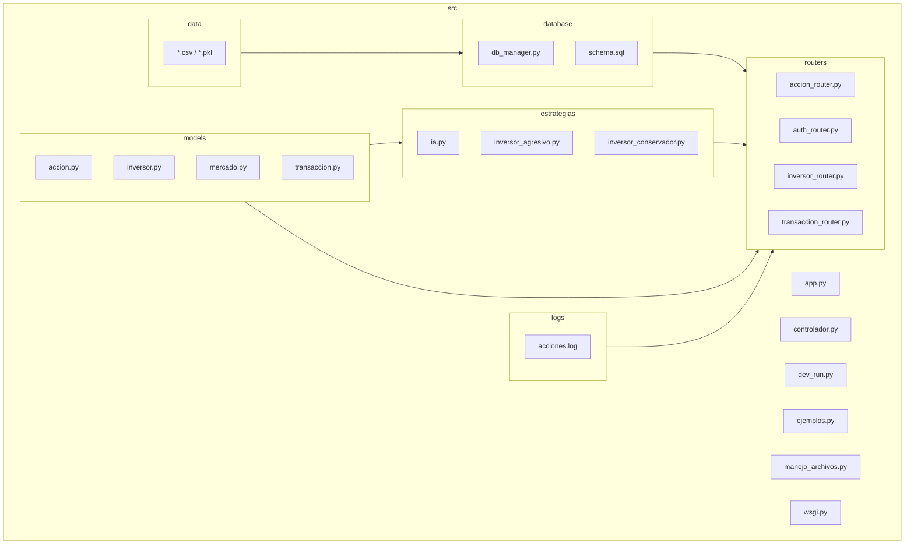

# SIMULADOR DE BOLSA

# Descripción
Te damos la bienvenida al simulador de inversiones, una herramienta con la que podrás explorar y practicar en el mundo del mercado de valores. Podrás comprar y vender acciones con datos reales y tomar posiciones compradores y vendedoras y ver las evoluciones de tus operaciones con el tiempo. Por otro lado, contarás con la opción de simular distintas estrategias de inversión, ya sea a corto o a largo plazo, siempre en un entorno seguro y libre de pérdidas.

# Dependencias necesarias
Con tal de que no haya complicaciones, recomendamos instalar todas las dependencias listadas en el archivo `requirements.txt`. Para ello puedes ejecutar desde la terminal el siguiente comando:

`pip install -r requirements.txt`

# Distribución de tareas
Patricia tiene como función principal desarrollar la API REST, para ello utiliza Flask para crear los distintos puntos finales requeridos: gestión de inversores, acciones y transacciones. Su trabajo también incluye el manejo de excepciones en las rutas con `abort` y `logging` para asegurar que las respuestas sean claras y controladas en caso de errores. También se encarga de el desarrollo y la actualización de todas las pruebas automáticas, tanto unitarias como de integración.

Mohamed, en cambio, se enfoca en el núcleo del mercado financiero simulado. Su tarea principal es diseñar e implementar las clases `Accion` y `Mercado`. Estas clases ayudan a modelar el comportamiento de los valores del mercado, mostrando su evolución en el tiempo, ya sea de manera aleatoria o con datos reales obtenidos a través de yfinance. Además, Mohamed se asegura de manejar posibles errores en este proceso, como problemas al conseguir precios o acciones que no existen. 

Niko se encarga de la creación del módulo de inversión y operaciones financieras. Él crea la clase base `Inversor` y sus especializaciones `InversorConservador` e `InversorAgresivo` que se encuentran en el apartado de estrategias, utilizando principios de herencia para reflejar diferentes tipos de inversión. También incorpora la sobrecarga de operadores como `__ add __` y `__ sub __` para realizar compras y ventas en el código. Además, es responsable de la clase `Transaccion`, que guarda el historial de operaciones, y gestiona archivos, tanto en formato de texto para crear registros, como en binario mediante pickle para serializar objetos como carteras completas.

Por último, Adrián se ocupa de todo lo relacionado con la persistencia de datos, implementando una base de datos relacional en SQLite. ha diseñado las tablas necesarias para inversores, acciones y transacciones, y desarrolla funciones CRUD para operar sobre ellas desde el código. También maneja las excepciones específicas de la base de datos, asegurando la integridad de los datos.

# Diagrama UML del Sistema

# Modo de empleo
## Uso del archivo `ejemplos`
Para ejecutar el programa es necesario darle los permisos necesarios de ejecución al archivo. Desde la terminal podemos usar el comando:

`chmod +x ejemplos`

Una vez otorgados los permisos correspondientes podemos inicial el programa:

`./ejemplos`

Al iniciar, el sistema mostrará un menú de opciones con las cuales el usuario puede llevar a cabo distintas operaciones sobre el mercado de valores, tales como crear acciones e inversores, simular compra/venta, actualizar precios, consultar carteras, consultar operaciones y muchos más.
Simplemente debes escribir el número de la opción que deseas usar y seguir las instrucciones en pantalla. Por ejemplo, si eliges la opción 5, el programa te pedirá el símbolo de una acción para mostrar sus datos. 

## Uso de la API
Este sistemas es una API que incluye una interfaz en modo de texto, desde la cual el usuario puede interactuar directamente con los endpoints mediante un menú con diversas opciones. 

Para poder interactuar con el sistema, primero debemos ejecutar el archivo `dev_run.py`, que inicializa la API de tal forma que pueda recibir peticiones ya que todas las operaciones depende de que la API esté activa.

Una ejecutado el paso anterior abrimos una nueva terminal (ya que la API tiene que estar en constante ejecución) y le otorgamos los permisos de ejecución necesarios al main:

`chmod +x main`

Luego ejecutamos el archivo:

`./main`

Esto iniciará una interfaz de texto. El objetivo final es acceder al menú de clientes, pero antes debemos iniciar sesión o registrarnos en el caso de que no seamos invesores.
Una vez iniciado sesión ya tenemos acceso completo al menú de cliente desde el cual podemos realizar operaciones para gestionar inversores, acciones o transacciones, además de consultar historiales. 
Al finalizar y haber seleccionado la opción salir (17) en el menú, debemos volver a la terminal donde se está ejecutando la API y detenerla con `Ctrl + C` en la terminal.

# Colaboradores

<!-- readme: collaborators -start -->
<table>
<tr>
    <td align="center">
        <a href="https://github.com/alg204">
            
             
            <b>Adrián</b>
        </a>
    </td>
    <td align="center">
        <a href="https://github.com/ppf30">
            
             
            <b>Patricia</b>
        </a>
    </td>
    <td align="center">
        <a href="https://github.com/NikolasKaplan1">
            
             
            <b>Nikolas</b>
        </a>
    </td>
    <td align="center">
        <a href="https://github.com/Mohamed-Arahouani">
            
             
            <b>Mohamed</b>
        </a>
    </td></tr>
</table>

# Licencia

Este proyecto está bajo la licencia MIT. Ver el archivo LICENSE para más detalles.
