# SIMULADOR DE BOLSA

# Descripción
Este simulador permitirá a los usuarios:

· Comprar y vender acciones en base a datos reales del mercado.

· Analizar el rendimiento de sus inversiones con gráficos.

· Simular estrategais de inversión a corto y largo plazo.

# Qué necesitas saber antes de probar nuestro código
Para que no haya errores a la hora de probar nuestro código, te recomendamos ejecutar todo el interior de requirements.txt
En este archivo se incluye la instalación de todas las librerías necesarias para la ejecución del *SIMULADOR DE BOLSA*.

# Distribución de tareas
Patricia tiene como función principal desarrollar la API REST, para ello utiliza Flask para crear los distintos puntos finales requeridos: gestión de inversores, acciones y transacciones. Su trabajo también incluye el manejo de excepciones en las rutas con `abort` para asegurar que las respuestas sean claras y controladas en caso de errores. También se encarga de el desarrollo y la actualización de todas las pruebas automáticas, tanto unitarias como de integración.

Mohamed, en cambio, se enfoca en el núcleo del mercado financiero simulado. Su tarea principal es diseñar e implementar las clases `Accion` y `Mercado`. Estas clases ayudan a modelar el comportamiento de los valores del mercado, mostrando su evolución en el tiempo, ya sea de manera aleatoria o con datos reales obtenidos a través de yfinance. Además, Mohamed se asegura de manejar posibles errores en este proceso, como problemas al conseguir precios o acciones que no existen. 

Niko se encarga de la creación del módulo de inversión y operaciones financieras. Él crea la clase base `Inversor` y sus especializaciones `InversorConservador` e `InversorAgresivo` que se encuentran en el apartado de estrategias, utilizando principios de herencia para reflejar diferentes tipos de inversión. También incorpora la sobrecarga de operadores como `__ add __` y `__ sub __` para realizar compras y ventas en el código. Además, es responsable de la clase `Transaccion`, que guarda el historial de operaciones, y gestiona archivos, tanto en formato de texto para crear registros, como en binario mediante pickle para serializar objetos como carteras completas.

Por último, Adrián se ocupa de todo lo relacionado con la persistencia de datos, implementando una base de datos relacional en SQLite. ha diseñado las tablas necesarias para inversores, acciones y transacciones, y desarrolla funciones CRUD para operar sobre ellas desde el código. También maneja las excepciones específicas de la base de datos, asegurando la integridad de los datos.

# Diagrama UML del Sistema

```mermaid
graph TD
  subgraph src
    auth["📦 auth"]
    data["📦 data"]
    database["📦 database"]
    estrategias["📦 estrategias"]
    logs["📦 logs"]
    models["📦 models"]
    routers["📦 routers"]
  end

  auth -->|usa JWT| routers
  data --> database
  database --> routers
  estrategias --> routers
  models --> routers
  models --> estrategias
  logs --> routers

  subgraph auth
    jwt["jwt.py"]
  end

  subgraph data
    archivos_csv["*.csv / *.pkl"]
  end

  subgraph database
    dbmanager["db_manager.py"]
    schema["schema.sql"]
    db["simulador.db"]
  end

  subgraph estrategias
    ia["ia.py"]
    inv_agresivo["inversor_agresivo.py"]
    inv_conservador["inversor_conservador.py"]
  end

  subgraph models
    accion["accion.py"]
    inversor["inversor.py"]
    mercado["mercado.py"]
    transaccion["transaccion.py"]
  end

  subgraph routers
    acc_router["accion_router.py"]
    inv_router["inversor_router.py"]
    trans_router["transaccion_router.py"]
    archivos["manejo_archivos.py"]
    main["main.py"]
    run["run.py"]
  end

```

# Colaboradores

<!-- readme: collaborators -start -->
<table>
<tr>
    <td align="center">
        <a href="https://github.com/alg204">
            
             
            <b>Adrián</b>
        </a>
    </td>
    <td align="center">
        <a href="https://github.com/ppf30">
            
             
            <b>Patricia</b>
        </a>
    </td>
    <td align="center">
        <a href="https://github.com/NikolasKaplan1">
            
             
            <b>Nikolas</b>
        </a>
    </td>
    <td align="center">
        <a href="https://github.com/Mohamed-Arahouani">
            
             
            <b>Mohamed</b>
        </a>
    </td></tr>
</table>

# Licencia

Este proyecto está bajo la licencia MIT. Ver el archivo LICENSE para más detalles.
