# SIMULADOR DE BOLSA DE VALORES

# DESCRIPCIÓN
Este simulador permitirá a los usuarios:
· Comprar y vender acciones en base a datos reales del mercado.
· Analizar el rendimiento de sus inversiones con gráficos.
· Simular estrategais de inversión a corto y largo plazo.

# Qué necesitas saber antes de probar nuestro código
Todas las cosas que serán decesarias para el correcto funcionamiento de nuestro proyecto a la hora de corregir

ej:
pip install numpy # Para instalar la librería numpy

# Distribución de tareas
1. *******
2. *******
3. *******
4. *******

# Estructura

```mermaid
graph TD;
    gestion_usu(gestión de Usuarios) --> liga(Liga);
    liga --> mercado(Mercado);
    liga --> plantilla(Plantilla);
    liga --> juego(Juego);
    juego --> puntos(Puntuación);

    classDef done fill:#00ff00,stroke:#000,stroke-width:2px,color:#000;
    classDef inprocess fill:#ffff00,stroke:#000,stroke-width:2px,color:#000;
    classDef notstarted fill:#ff0000,stroke:#000,stroke-width:2px,color:#000;

    class gestion_usu,liga done;
    class mercado,plantilla inprocess;
    class juego,puntos notstarted;
```

-  `Done`
-  `In process`
-  `Not started`

# Colaboradores

<!-- readme: collaborators -start -->
<table>
<tr>
    <td align="center">
        <a href="https://github.com/alg204">
            
             
            <b>Adrián</b>
        </a>
    </td>
    <td align="center">
        <a href="https://https://github.com/ppf30">
            
             
            <b>Patricia</b>
        </a>
    </td>
    <td align="center">
        <a href="https://github.com/NikolasKaplan1">
            
             
            <b>Nikolas</b>
        </a>
    </td>
    <td align="center">
        <a href="https://github.com/Mohamed-Arahouani">
            
             
            <b>Mohamed</b>
        </a>
    </td></tr>
</table>

# Licencia

Este proyecto está bajo la licencia MIT. Ver el archivo LICENSE para más detalles.
